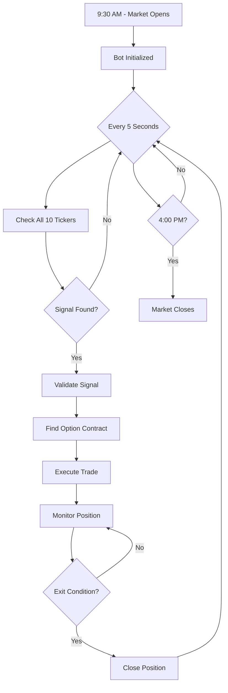
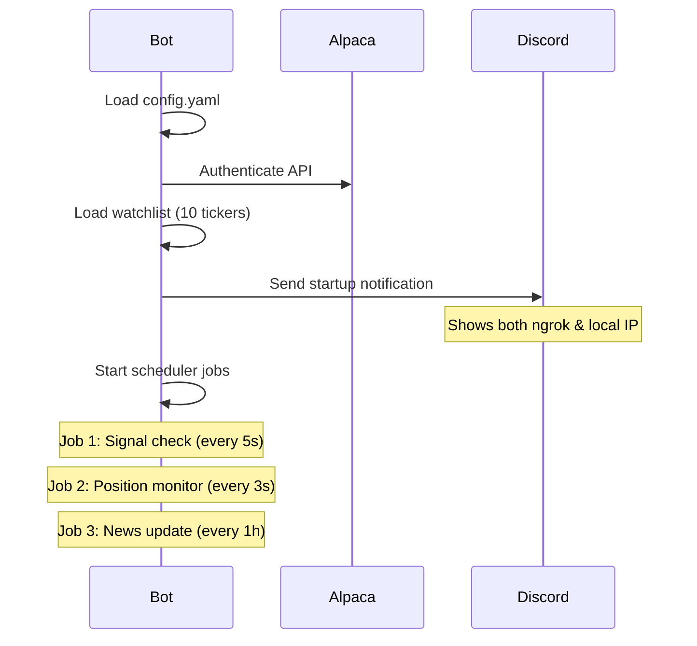
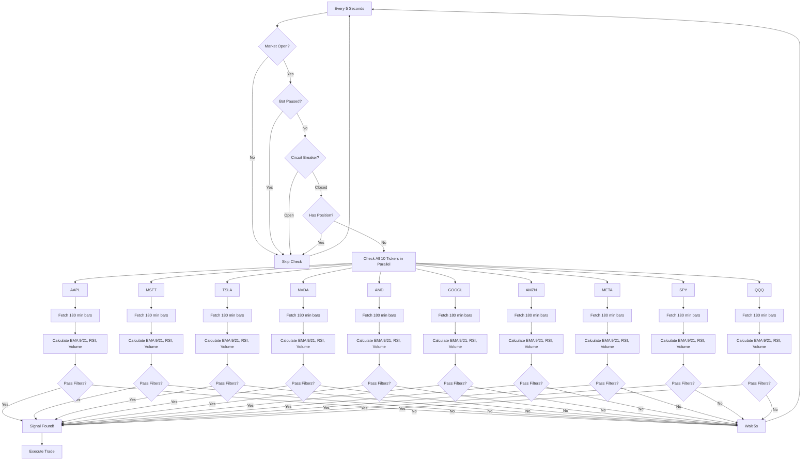
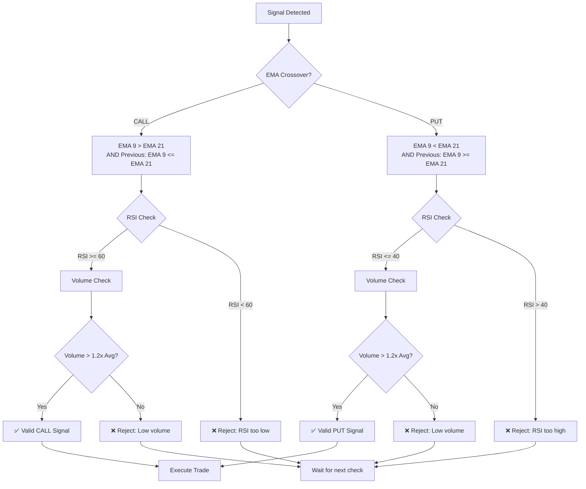
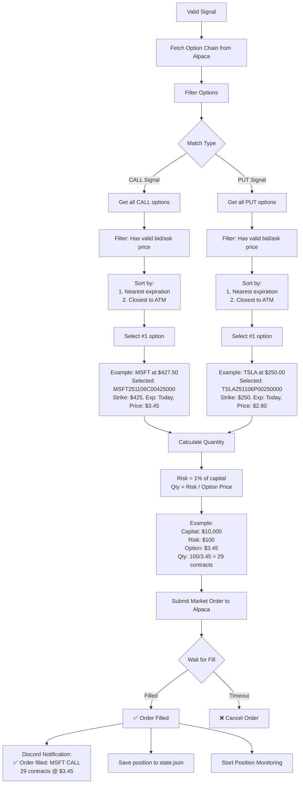
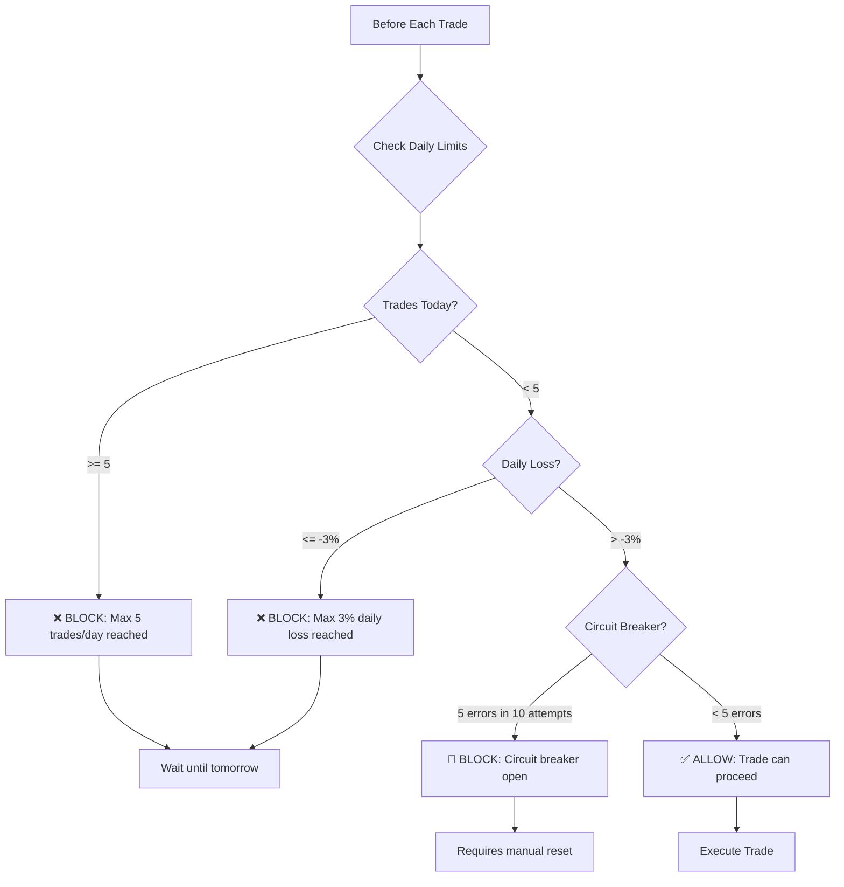

# 🤖 Scalp Bot Complete Workflow

## 📊 What Happens During Market Hours

This document explains **exactly** what your bot does from market open to close.

---

## 🎬 High-Level Overview



---

## 🔄 Detailed Workflow

### **Phase 1: Initialization (9:30 AM)**



---

### **Phase 2: Signal Detection (Every 5 Seconds)**



---

### **Phase 3: Signal Validation (When Signal Found)**



---

### **Phase 4: Option Selection & Trade Execution**



---

### **Phase 5: Position Monitoring (Every 3 Seconds)**

```mermaid
flowchart TD
    Start[Every 3 Seconds] --> HasPos{Has Position?}
    HasPos -->|No| Skip[Skip]
    HasPos -->|Yes| GetPrice[Get Current Option Price]
    
    GetPrice --> CalcPnL[Calculate P/L %<br/>PnL = (Current - Entry) / Entry × 100]
    
    CalcPnL --> Example[Example:<br/>Entry: $3.45<br/>Current: $3.97<br/>PnL: +15.07%]
    
    Example --> Check1{Profit Target?}
    Check1 -->|PnL >= 15%| Exit1[✅ EXIT: Profit Target Hit!]
    Check1 -->|No| Check2{Stop Loss?}
    
    Check2 -->|PnL <= -7%| Exit2[🛑 EXIT: Stop Loss Hit!]
    Check2 -->|No| Check3{Timeout?}
    
    Check3 -->|> 5 minutes| Exit3[⏰ EXIT: Timeout!]
    Check3 -->|No| Check4{EOD?}
    
    Check4 -->|Time >= 3:55 PM| Exit4[🌅 EXIT: End of Day!]
    Check4 -->|No| Check5{Reversal?}
    
    Check5 -->|EMA Reversed| Exit5[🔄 EXIT: Signal Reversed!]
    Check5 -->|No| Continue[Continue Monitoring]
    
    Exit1 --> Close[Close Position]
    Exit2 --> Close
    Exit3 --> Close
    Exit4 --> Close
    Exit5 --> Close
    
    Close --> SubmitOrder[Submit Market Sell Order]
    SubmitOrder --> WaitFill{Wait for Fill}
    WaitFill -->|Filled| Record[Record Trade in CSV]
    WaitFill -->|Timeout| ForceClose[Force Close]
    
    Record --> NotifyExit[Discord Notification:<br/>💰 Position closed: MSFT CALL<br/>Entry: $3.45, Exit: $3.97<br/>P/L: +15.07% (+$15.08)]
    
    NotifyExit --> ClearState[Clear position from state.json]
    ClearState --> Ready[Ready for next signal]
    
    Continue --> Start
    Skip --> Start
```

---

### **Phase 6: Daily Limits & Circuit Breaker**



---

## 📋 Complete Daily Timeline Example

### **9:30 AM - Market Opens**
```
✅ Bot initialized
✅ Loaded 10 tickers: AAPL, MSFT, TSLA, NVDA, AMD, GOOGL, AMZN, META, SPY, QQQ
✅ Discord notification sent
✅ Started signal detection (every 5s)
✅ Started position monitoring (every 3s)
✅ Started news updates (every 1h)
```

### **9:30:05 AM - First Signal Check**
```
🔍 Checking AAPL... No signal
🔍 Checking MSFT... No signal
🔍 Checking TSLA... No signal
🔍 Checking NVDA... No signal
🔍 Checking AMD... No signal
🔍 Checking GOOGL... No signal
🔍 Checking AMZN... No signal
🔍 Checking META... No signal
🔍 Checking SPY... No signal
🔍 Checking QQQ... No signal
⏳ Wait 5 seconds...
```

### **10:15:30 AM - Signal Detected!**
```
🚨 SIGNAL DETECTED: MSFT CALL
📊 Price: $427.50
📈 EMA 9: 426.80 > EMA 21: 425.50 (Crossover confirmed!)
📊 RSI: 65.2 (> 60 ✅)
📊 Volume: 2.5M (1.8x average ✅)
✅ All filters passed!

🔍 Selecting option contract...
📋 Got 847 options in chain
✅ Filtered to 124 valid CALL options
🎯 Selected: MSFT251106C00425000
   Strike: $425.00 ($2.50 from ATM)
   Expiration: 2025-11-06 (0.3 DTE)
   Price: $3.45

💰 Calculating quantity...
   Capital: $10,000
   Risk: 1% = $100
   Option price: $3.45
   Quantity: 29 contracts

📤 Submitting order to Alpaca...
⏳ Waiting for fill...
✅ Order filled: 29 contracts @ $3.45
💵 Total cost: $100.05

📱 Discord notification sent
💾 Position saved to state.json
👁️ Started monitoring position
```

### **10:15:33 AM - Position Monitoring Starts**
```
📊 Monitoring MSFT CALL position...
   Entry: $3.45
   Current: $3.48
   P/L: +0.87% (+$0.87)
⏳ Continue monitoring...
```

### **10:16:00 AM - Still Monitoring**
```
📊 Monitoring MSFT CALL position...
   Entry: $3.45
   Current: $3.62
   P/L: +4.93% (+$4.93)
⏳ Continue monitoring...
```

### **10:18:15 AM - Profit Target Hit!**
```
📊 Monitoring MSFT CALL position...
   Entry: $3.45
   Current: $3.97
   P/L: +15.07% (+$15.08)
✅ PROFIT TARGET HIT! (>= 15%)

🔄 Closing position...
📤 Submitting sell order...
✅ Position closed @ $3.97
💰 Profit: +$15.08 (+15.07%)

📊 Trade recorded to CSV:
   Ticker: MSFT
   Direction: CALL
   Entry: $3.45
   Exit: $3.97
   Contracts: 29
   P/L: +$15.08
   Duration: 2m 45s

📱 Discord notification sent
💾 State cleared
✅ Ready for next signal
```

### **10:18:20 AM - Back to Signal Detection**
```
🔍 Checking all tickers again...
⏳ No signals found
⏳ Wait 5 seconds...
```

### **11:30:00 AM - News Update**
```
📰 Updating news for 10 tickers...
🤖 Calling OpenAI for analysis...
✅ News updated:
   AAPL: Bullish, High entry likelihood
   MSFT: Bullish, Medium entry likelihood
   TSLA: Bearish, Low entry likelihood
   ...
💾 Cached for dashboard display
```

### **3:55:00 PM - End of Day Check**
```
⏰ 3:55 PM - End of day approaching
📊 Checking for open positions...
✅ No open positions
📊 Daily summary:
   Trades: 3
   Wins: 2
   Losses: 1
   P/L: +$28.50 (+0.29%)
```

### **4:00:00 PM - Market Closes**
```
🌅 Market closed
⏸️ Signal detection paused
⏸️ Position monitoring paused
📊 Bot remains running (ready for tomorrow)
```

---

## 🎯 Key Points

### **What Bot Does:**
1. ✅ Checks 10 tickers every 5 seconds
2. ✅ Validates signals with 3 filters (EMA, RSI, Volume)
3. ✅ Selects nearest ATM option on next expiring contract
4. ✅ Executes trade with 1% risk
5. ✅ Monitors position every 3 seconds
6. ✅ Exits on profit target (15%), stop loss (7%), timeout (5min), or EOD
7. ✅ Records all trades to CSV
8. ✅ Sends Discord notifications
9. ✅ Updates news hourly

### **What Bot Doesn't Do:**
- ❌ Trade outside market hours (9:30 AM - 4:00 PM)
- ❌ Trade when paused or circuit breaker open
- ❌ Trade if already has a position
- ❌ Trade if daily limits reached (5 trades or 3% loss)
- ❌ Hold positions overnight (force exit at 3:55 PM)

### **Safety Features:**
- 🛡️ Max 1% risk per trade
- 🛡️ Max 5 trades per day
- 🛡️ Max 3% daily loss
- 🛡️ Circuit breaker (5 errors = pause)
- 🛡️ Force exit before market close
- 🛡️ Stop loss at 7%
- 🛡️ Timeout after 5 minutes

---

## 📊 Statistics

**Per Day:**
- Signal checks: ~4,680 (6.5 hours × 12 checks/min)
- Position checks: ~7,800 (when in position, every 3s)
- API calls to Alpaca: ~5,000-10,000
- Trades: 0-5 (limited by daily max)
- News updates: 6-7 (hourly during market hours)

**Per Trade:**
- Average duration: 2-5 minutes
- Success rate: Depends on market conditions
- Risk per trade: 1% of capital
- Potential profit: 15% (target)
- Potential loss: 7% (stop loss)

---

This is your bot's complete workflow! 🚀
